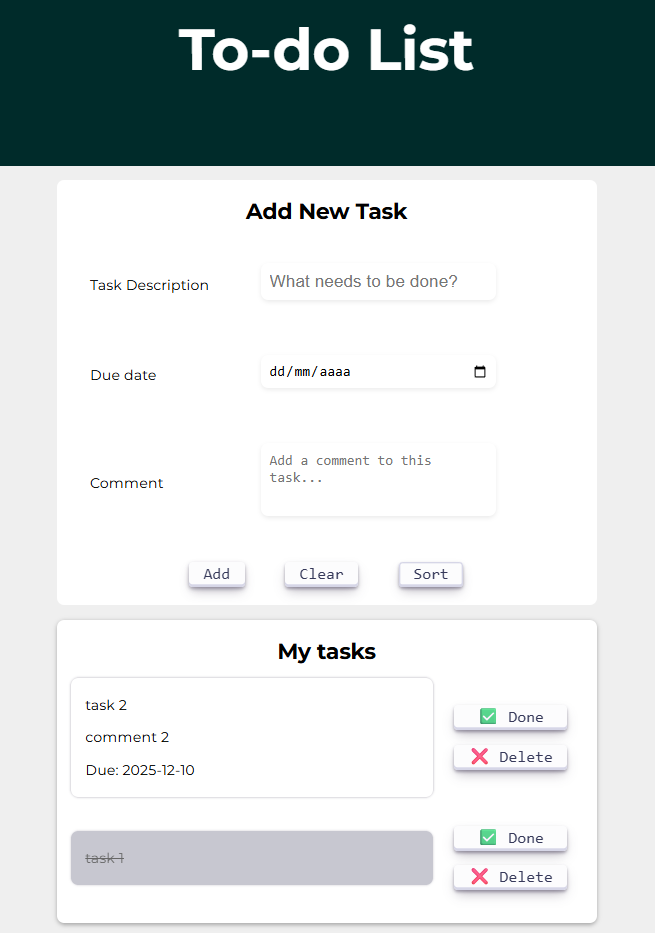

# 📝 To-Do List Web App

A lightweight and simple task manager designed to run locally in your browser. No installation or internet required — just clone the repo and open the `index.html` file.

## Features

- Add tasks with title, comment, and due date
- Persistent data using `localStorage`
- Mark tasks as completed and delete them easily
- Clean and user-friendly interface

# 

