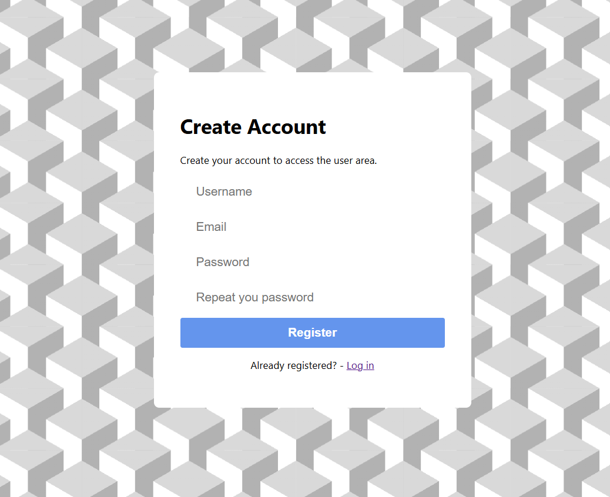

# 📝 To-Do List Web App

This is a web application where you can record and manage all your pending tasks.

It’s a re-design of my first to-do list project. Instead of using local storage, this version uses a **MySQL database** to store users and their tasks. The motivation behind this app was to explore web architecture and technologies such as **JavaScript, HTML, Node.js**, and more — and to understand how the front-end, back-end, and database communicate with each other.

I'd also like to mention [PuntoJson](https://www.youtube.com/@puntojson), whose videos were incredibly helpful for learning these concepts. The core login and registration logic is based on his tutorials, but I extended it by integrating database operations and query handling.

## Features

- Add tasks with a title, description, and due date  
- Persistent data using MySQL  
- Mark tasks as completed and delete them easily  
- Clean and user-friendly interface  

## Technologies Used

- Frontend: HTML, CSS, JavaScript  
- Backend: Node.js (Express)  
- Database: MySQL  

  

  

  

